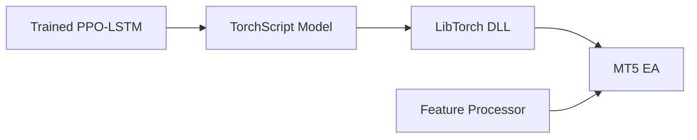

# DRL Model DLL for MetaTrader 5

This project provides a fast and reliable way to run PyTorch LSTM models in MetaTrader 5 using LibTorch. By using the native C++ DLL approach, we avoid the complexity and potential issues of reimplementing LSTM in MQL5.

## Quick Start

1. **Prerequisites Installation**:
```batch
# Install Python dependencies
pip install -r requirements.txt

# Install vcpkg and dependencies
git clone https://github.com/microsoft/vcpkg.git
cd vcpkg
bootstrap-vcpkg.bat
vcpkg integrate install
vcpkg install nlohmann-json:x64-windows
```

2. **Download LibTorch**:
- Go to [PyTorch website](https://pytorch.org/)
- Select:
  - Stable build
  - Windows
  - LibTorch
  - C++/Java
  - CPU (recommended for MT5)
- Extract to a convenient location

3. **Build the DLL**:
```powershell
# Run build script
./build.ps1 -LibTorchPath "C:/path/to/libtorch" `
           -VcpkgPath "C:/path/to/vcpkg" `
           -MT5Path "C:/Program Files/MetaTrader 5" `
           -BuildType "Release"
```

4. **Export Your Model**:
```bash
# Export trained model to TorchScript
python scripts/export_torchscript.py --model-path path/to/your/model.zip --output-dir output
```

5. **Deploy to MT5**:
- Copy `output/model.pt` and `output/model_config.json` to `C:/MT5/`
- Compile and attach `DRLTrader.mq5` to your chart

## Project Structure

```
drl_model/
├── src/                    # C++ source files
│   ├── model_wrapper.h     # LibTorch wrapper
│   ├── model_wrapper.cpp   # Implementation
│   └── dll_interface.cpp   # MT5 interface
├── scripts/
│   └── export_torchscript.py  # Model export
└── build.ps1              # Build automation
```

## Architecture Overview



## Features

- **High Performance**: Native C++ implementation using LibTorch
- **Reliable**: Uses PyTorch's proven LSTM implementation
- **Easy Integration**: Simple DLL interface for MT5
- **State Management**: Proper LSTM state handling
- **Feature Processing**: Matches Python training environment

## Configuration

The EA supports the following inputs:

- `ModelPath`: Path to TorchScript model (default: "C:\\MT5\\model.pt")
- `ConfigPath`: Path to model config (default: "C:\\MT5\\model_config.json")
- `MaxSpread`: Maximum allowed spread (points)
- `BalancePerLot`: Account balance required per 0.01 lot

## Troubleshooting

1. **DLL Load Failed**:
   - Verify all LibTorch DLLs are in MT5's Libraries folder
   - Install Visual C++ Redistributable 2019
   - Check MT5 Expert logs for specific error message

2. **Model Load Failed**:
   - Check model.pt file path
   - Verify model_config.json format
   - Ensure feature count matches training

3. **Incorrect Predictions**:
   - Enable detailed logging in EA
   - Compare feature values with Python
   - Check LSTM state management

## Contributing

1. Fork the repository
2. Create your feature branch
3. Commit your changes
4. Push to the branch
5. Create a Pull Request

## License

This project is licensed under the MIT License - see the LICENSE file for details.

## Acknowledgments

- PyTorch team for LibTorch
- MetaQuotes for MT5
- Stable-Baselines3 for RecurrentPPO implementation
